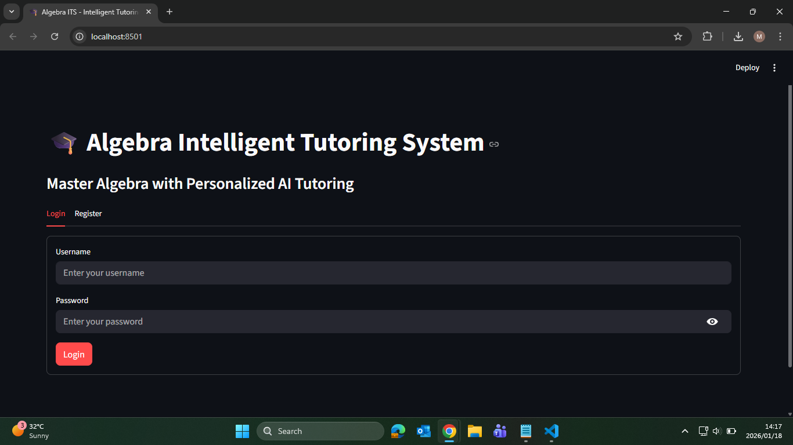
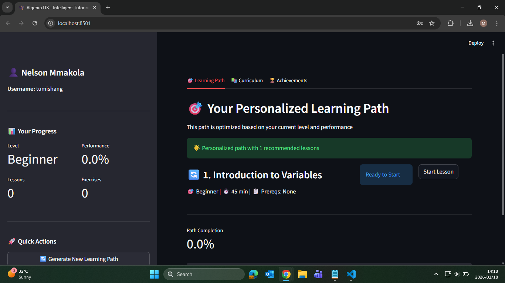
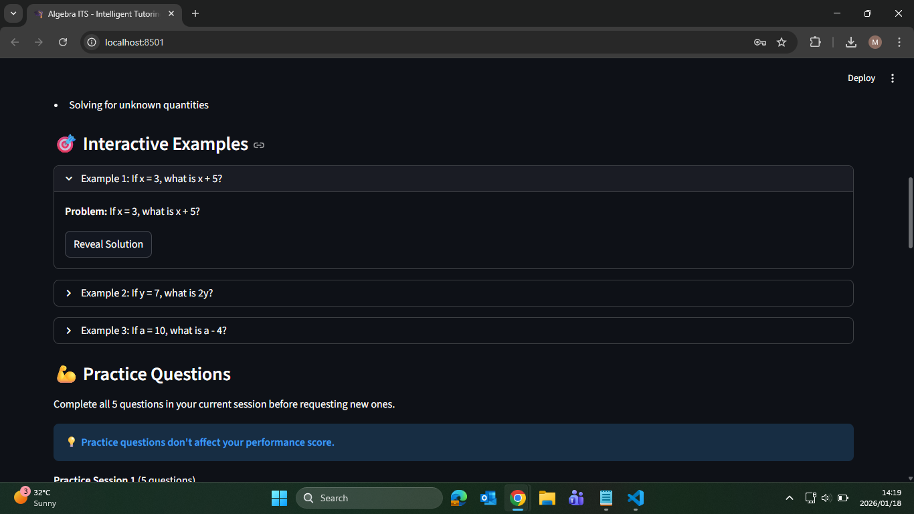

# Algebra Intelligent Tutoring System (CSP-Based)

An AI-powered Intelligent Tutoring System designed to assist learners in solving algebra problems using Constraint Satisfaction Problems (CSPs).
The system guides users step-by-step through problem-solving using rule-based reasoning.

This project was developed as part of an Artificial Intelligence academic project.

---

# 🛠️ Technologies Used

⦁	Programming Language: Python
⦁	Web Framework: Streamlit
⦁	Database: SQLite
⦁	Development Environment: Visual Studio Code

---

# ✨ Features

* Step-by-step algebra problem-solving guidance
* Constraint-based and rule-driven reasoning
* Simple interactive user interface
* Storage of problem data using SQLite

---

# 🧠 Artificial Intelligence Concepts

⦁	Constraint Satisfaction Problems (CSP)
⦁	Rule-based reasoning
⦁	Knowledge representation
⦁	Logical inference

---

# 📂 Project Setup

## Prerequisites

Ensure you have the following installed:

⦁	Python
⦁	Streamlit
⦁	SQLite
⦁	Visual Studio Code

---

## Installation Steps

1. Download or clone the project

   * Download the file from GitHub

2. Install required Python packages & Run the application
   
   * Make use of the information on the file `requirements.txt`

3. Access the system
   The application will open automatically in your web browser.

---

# 🎓 Academic Context

This system was developed to demonstrate the application of Artificial Intelligence techniques, particularly CSPs, in an educational tutoring environment.

---

# 🚀 Future Improvements

⦁	Support for more complex algebra problems
⦁	Improved user interface and feedback
⦁	Performance optimisation for larger problem sets

---

# 👤 Author

Moses Mmakola
BSc Mathematical & Computer Sciences
Sol Plaatje University

⦁	GitHub: https://github.com/mosesmmakola
⦁	LinkedIn: https://www.linkedin.com/in/moses-mmakola-9a08bb378

---

